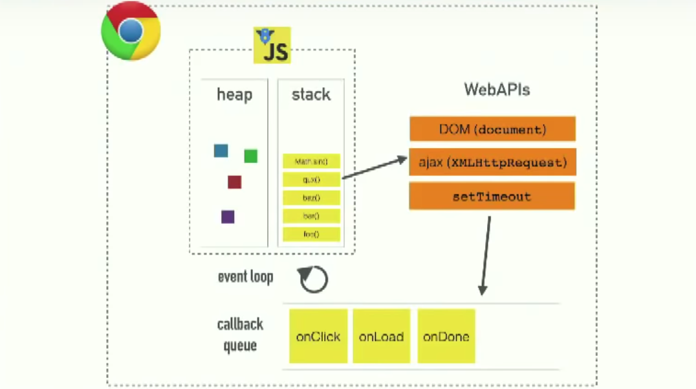

# Ajax - FE

3.1 Ajax 응답 처리와 비동기
~~~
자바스크립트는 싱글 쓰레드인데 어떻게 Async하게 동작하는 ajax를 수행하는걸까?

답은 WebApi가 Async의 수행을 대신 해주기 때문이다.
~~~
~~~
아래의 그림과 같다.

1. main() 부터 stack에 쌓이기 시작한다.

2. WebApi에 async인 함수인 경우 들어가게 되며 그 안에서 실행한다.

3. WebApi에서 수행이 끝나게 되면 callbackQueue에 넣어준다.

4. stack에 아무것도 없게 된다면 callbackQueue에서 stack에 넣어주고 일을 수행하게 된다.
~~~